<h1>Aula 12</h1>

Esta clase consiste en presentar las principales características del robot SCARA T3 EPSON.

<h2>Robot SCARA T3 EPSON</h2>

El robot SCARA T3 de EPSON trae el controlador (401S) incorporado, además, es de 4 GDL de morfología RRPR. Este robot es colaborativo y pueden ser implementados en procesos repetitivos de bajo peso, como pick and place, ensamble de piezas, atornillado, empaque, paletización, inspección, entre otras. El SCARA T3 tiene un payload de 3kg. Los manuales pueden ser descargados <a href="https://epson.com/Support/Robots/SCARA-Robots/SCARA-T-Series/Epson-T3-SCARA-Robots/s/SPT_RT3-401SS?msockid=2b05a932c833625a0705b92ac9ce634f#manuals">aquí</a>

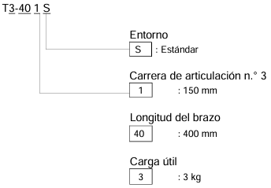
 
<figcaption>Fuente: Manual del manipulador Serie T</figcaption>

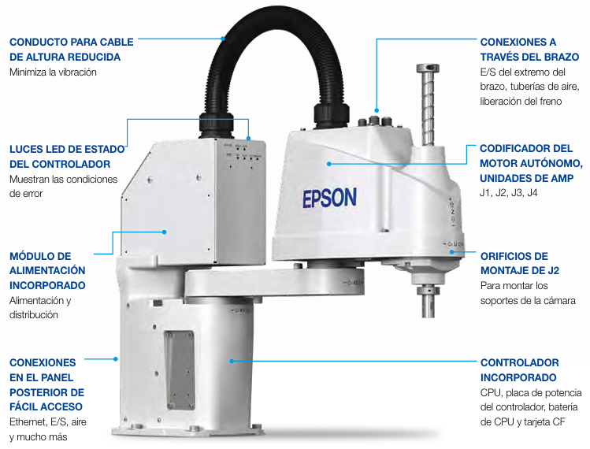
 
<figcaption>Fuente: Epson T-Series SCARA Robot Brochure</figcaption>

<h3>Especificaciones técnicas</h3>

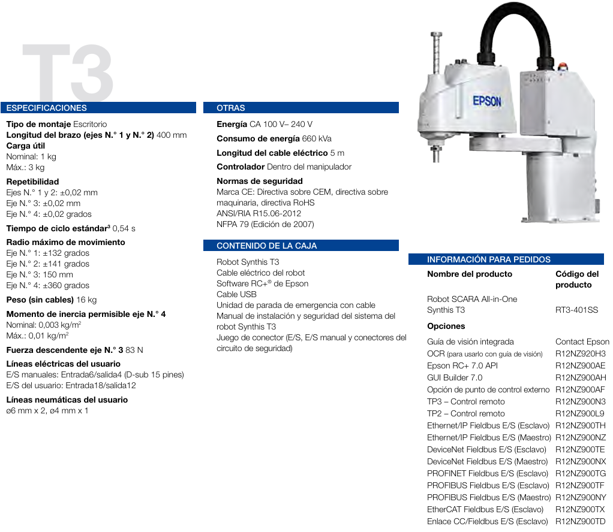
 
<figcaption>Fuente: Epson T-Series SCARA Robot Brochure</figcaption>

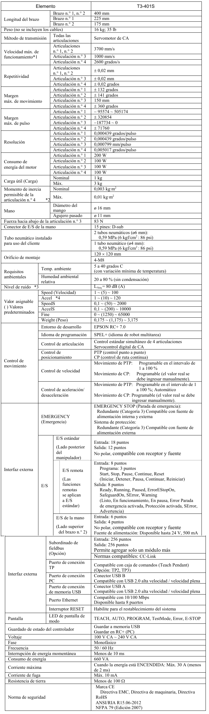
 
<figcaption>Fuente: Sistema de robot, seguridad e instalación</figcaption>

<h3>Espacio de trabajo</h3>

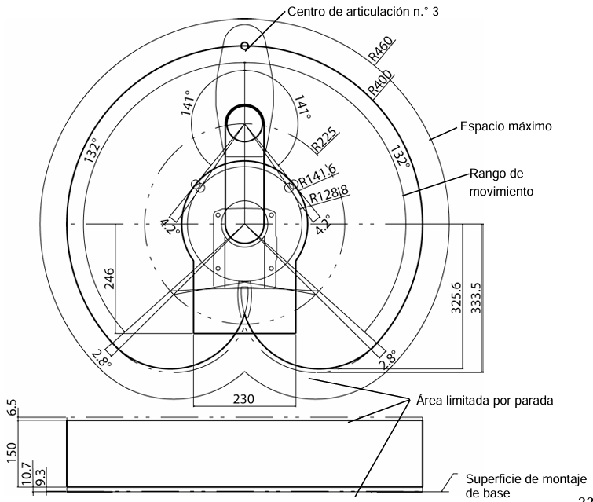
 
<figcaption>Fuente: Manual del manipulador Serie T</figcaption>

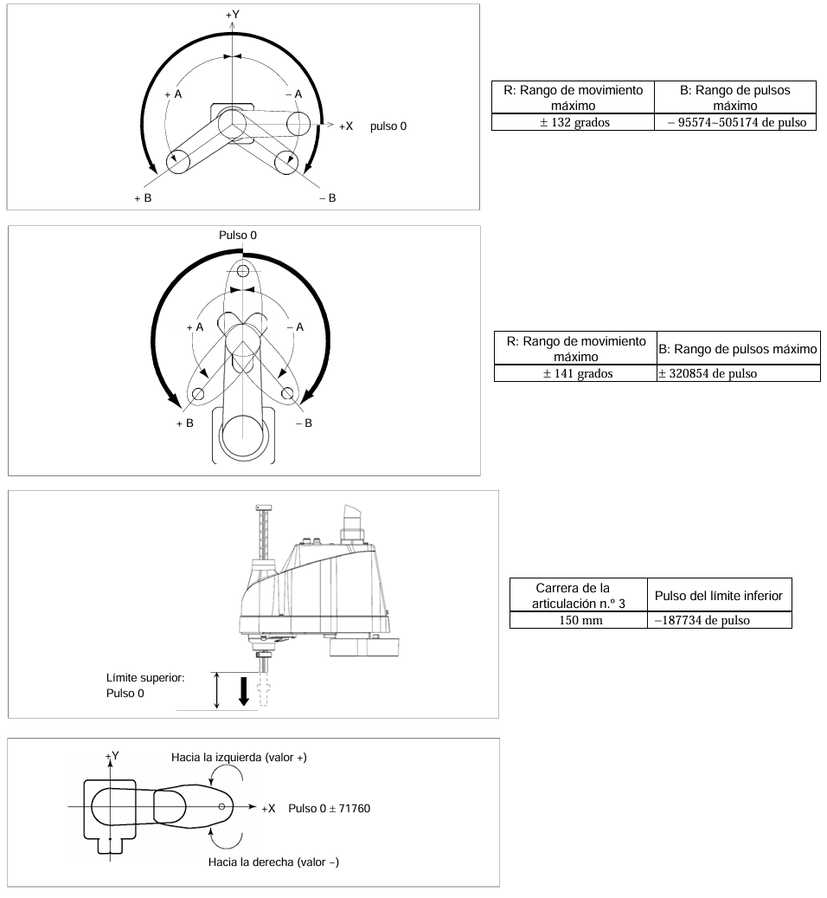
 
<figcaption>Fuente: Manual del manipulador Serie T</figcaption>

<h3>Partes del SCARA T3 EPSON</h3>

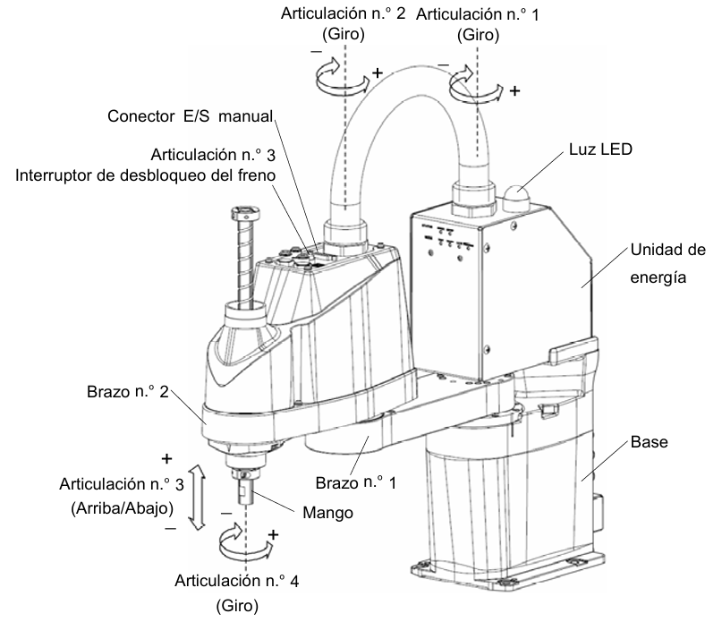
 
<figcaption>Fuente: Sistema de robot, seguridad e instalación</figcaption>

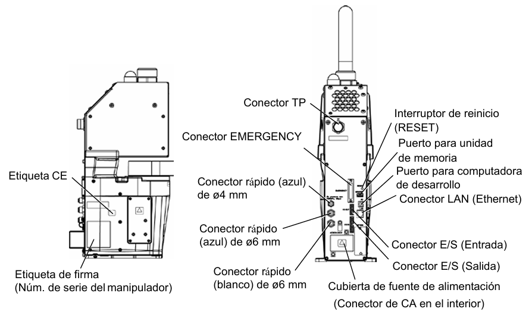
 
<figcaption>Fuente: Sistema de robot, seguridad e instalación</figcaption>

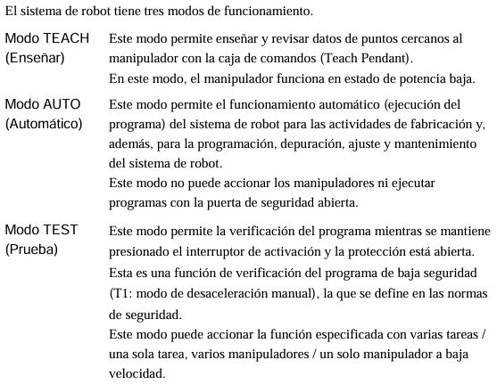
 
<figcaption>Fuente: Manual del manipulador Serie T</figcaption>

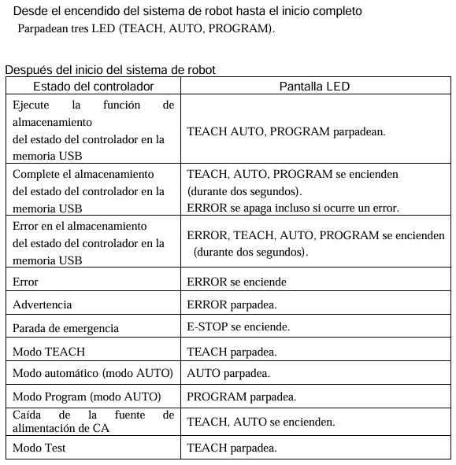
 
<figcaption>Fuente: Manual del manipulador Serie T</figcaption>

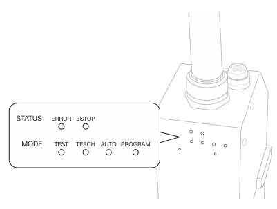
 
<figcaption>Fuente: Guía de instalación Serie T Robot SCARA</figcaption>

<h3>Controlador</h3>

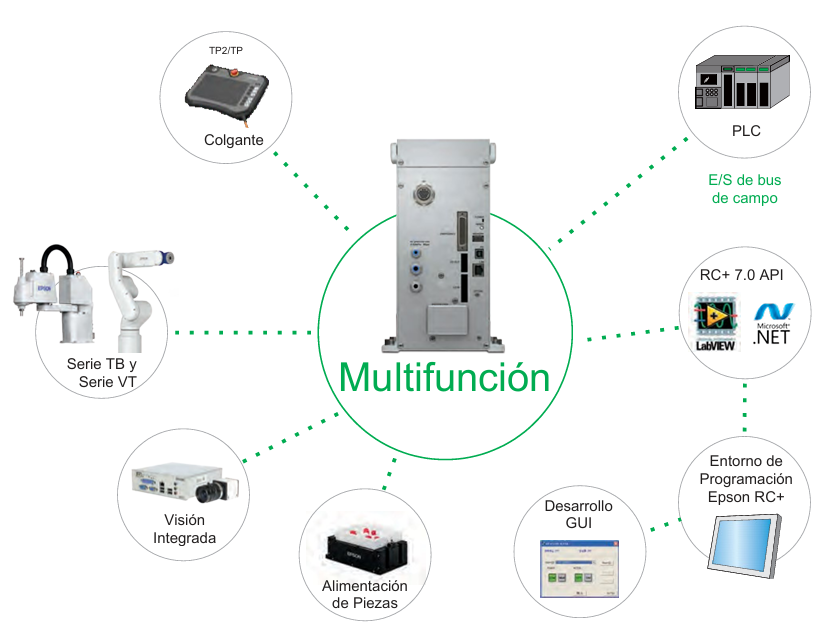
 
<figcaption>Fuente: Epson T-Series SCARA Robot Brochure</figcaption>

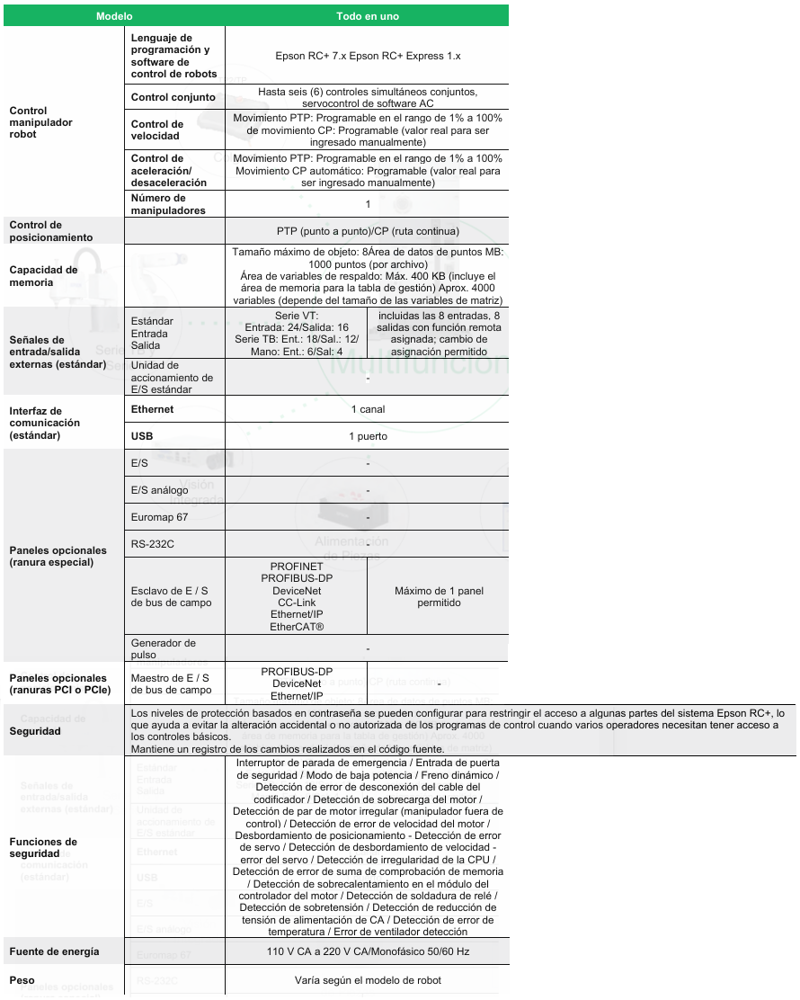
 
<figcaption>Fuente: Epson T-Series SCARA Robot Brochure</figcaption>

<h4>E/S</h4>

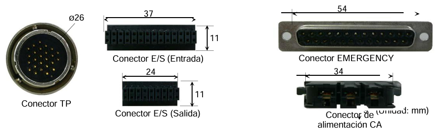
 
<figcaption>Fuente: Manual del manipulador Serie T</figcaption>

<h3>Funciones de seguridad</h3>

<h3>Ventajas</h3>

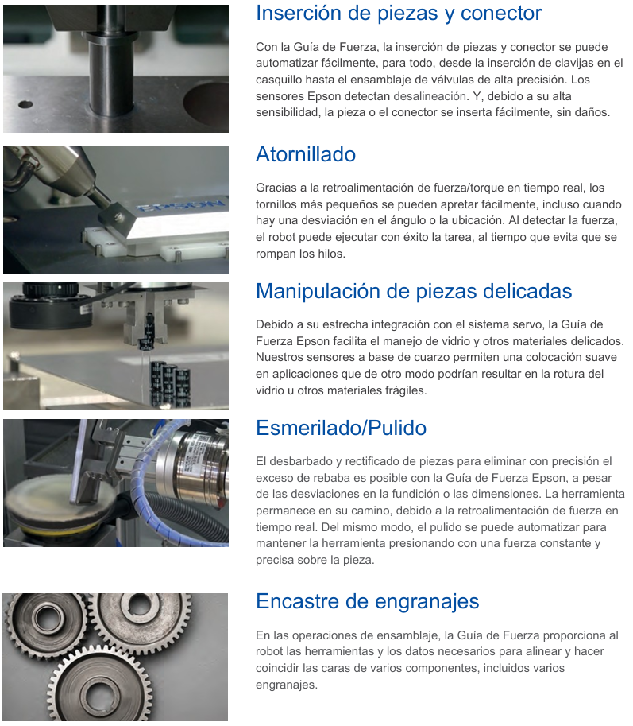
 
<figcaption>Fuente: Epson T-Series SCARA Robot Brochure</figcaption>

<h3>Casos de estudio</h3>

