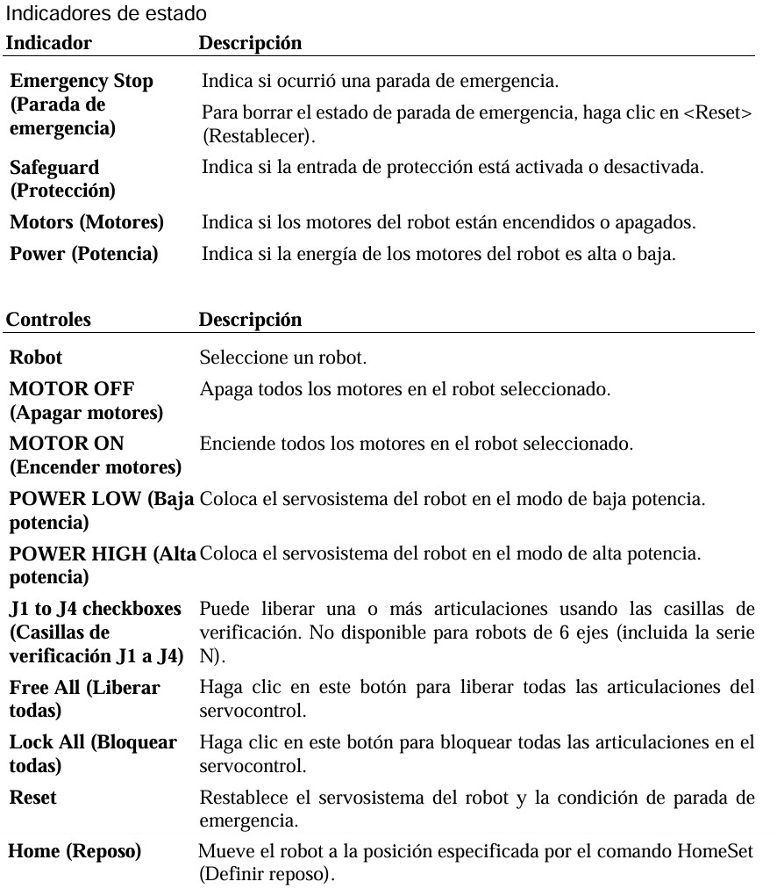
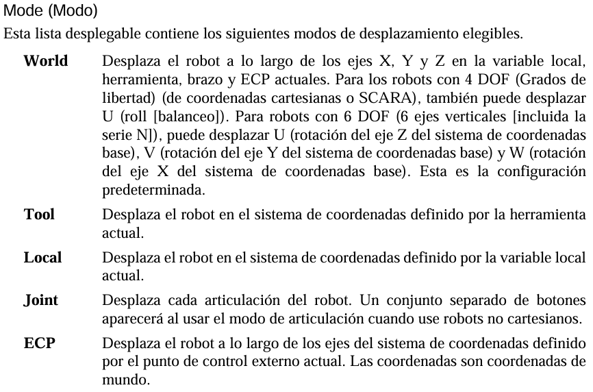
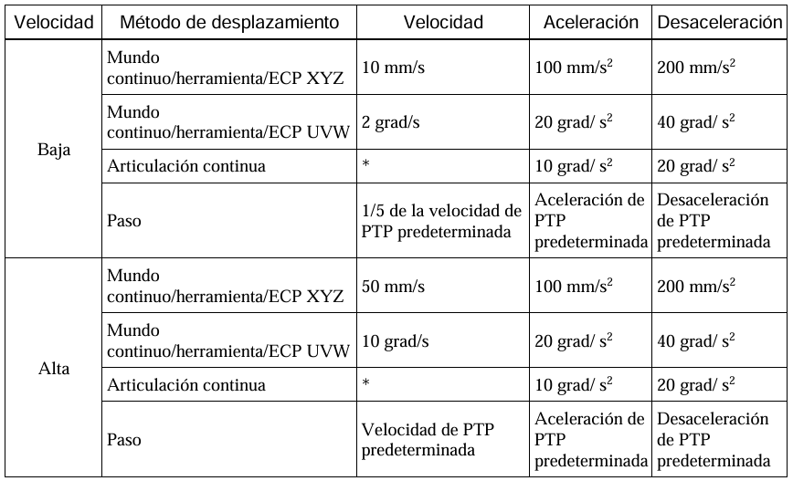
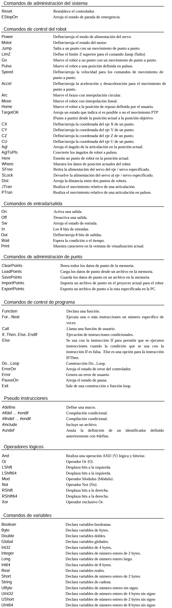

<h1>Aula 13</h1>

Esta clase consiste en simular el robot SCARA T3 EPSON en el software EPSON RC+ 7 a través del robot manager y de comandos.

<h2>EPSON RC+ 7</h2>

El software EPSON RC+ 7 permite simular el robot SCARA T3-401S, utilizando la ventana del robot manager y de comandos en lenguaje SPEL+. Es un entorno integrado con el controlador de visión por cámara.

Para simular el robot T3-401S se debe crear un controlador virtual en el software EPSON RC+ 7, para esto se deben seguir los siguiente pasos:

1.
2. En la opción 
3.
4.
5.

<h3>Comandos SPEL+</h3>

SPEL+ es un lenguaje de programación de Epson para aplicaciones de automatización de robots. Con más de 500 comandos y declaraciones, que incluyen funciones de movimiento, control de E/S, variables y tipos de datos, control de programas, etc.

<h4>Robot Manager</h4>

La pestalla de Control Panel contiene los botones para las operaciones básicas del robot, como encender y apagar los motores y devolver el robot a la posición de reposo. Además, muestra el estado de Parada de emergencia, Protección, Motores y Energía. 

<div align="center">

<br>
<figcaption>Fuente: Manual del usuario</figcaption>
</div>

La pestalla de Jog & Teach se usa principalmente para desplazar el robot a una posición deseada y enseñar un punto con las coordenadas y orientación actuales. Puede desplazar el robot en los modos World (Mundo), Tool (Herramienta), Local (Variable local), Joint (Articulación) o ECP (Punto de control externo). También puede ejecutar comandos de movimiento (ej: Go, Jump, etc.).

<div align="center">

<br>
<figcaption>Fuente: Manual del usuario</figcaption>
</div>

Cuando arranca RC+ y aparece el panel Jog & Teach, la velocidad está definida en Baja. El desplazamiento siempre está en modo de baja potencia. Las velocidades y las aceleraciones asociadas con la configuración de velocidad de desplazamiento se muestran en la página a continuación.

<div align="center">

<br>
<figcaption>Fuente: Manual del usuario</figcaption>
</div>

<h4>Command Window</h4>

<div align="center">

<br>
<figcaption>Fuente: Manual del usuario</figcaption>
</div>

motor On/Off %Encender/Apagar robot
on/off 4 %Encender/Apagar la salida digital No. 4
?sw(8) %Pregunta el estado de la entrada digital No. 8
print erroron %Imprime el estado de error del robot
JTran 1,90 %Mueve la articulación 1, 90 grados
SavePoints "robot1.pts"
here p1 %Guarda la coordenadas actuales X, Y y Z en el P1
go here :z(-50)
Pulse 0,0,0,0 %Coloca las articulaciones en la posición de calibración de fábrica (0 grados y 0 mm)

Power High/Low %Low es el 20% de la potencia del robot

<h4>Ventada de programación</h4>


<h3>Ejemplo 1</h3>

```SPEL+
Go JA(-90,90,0,0,0,0)
Go JA(-90,90,-50,0,0,0)
Jump JA(0,90,-50,0,0,0)
Jump JA(90,90,0,0,0,0)
```

```SPEL+
Function main 
	Go P1 
	Go P2 
	Go P0 
Fend 
```

```SPEL+
Function main 
	Print "This is my first program." 
	Power High 
	Speed 20 
	Accel 20, 20 
	Go P1 
	Go P2 
	Go P0 
Fend 
```

```SPEL+
Function main
	Motor On
	Jump P1
	On 4
	Jump P2
	Off 4
	Wait 1
	On 4
	Jump P3
	Off 4
	Motor Off
Fend
```


```SPEL+
Function main
	Print "THIS IS MY FIRST PROGRAM"
	Print "MOTOR STATE:", Motor
    Motor On
	Jump P0
	Jump P1
	Jump P2
    Motor Off
Fend
```

<h3>Ejemplo 2</h3>

```SPEL+
Function main
	Print "THIS IS MY SECOND PROGRAM"
	Print "MOTOR STATE:", Motor
	Call ENABLE_ARMS
	If ENABLE_ARMS = True Then
		Print "Enable complete"
	Else
		Print "Incomplete enable"
	EndIf
	Jump P0
	Jump P1
	Jump P2
Fend
Function ENABLE_ARMS As Boolean
	If ErrorOn Then Reset
	If Not Motor Then Motor On
	'Speed ProdVelocity
	'Print Speed
	ENABLE_ARMS = True
Fend
```

<h3>Ejemplo 3</h3>
