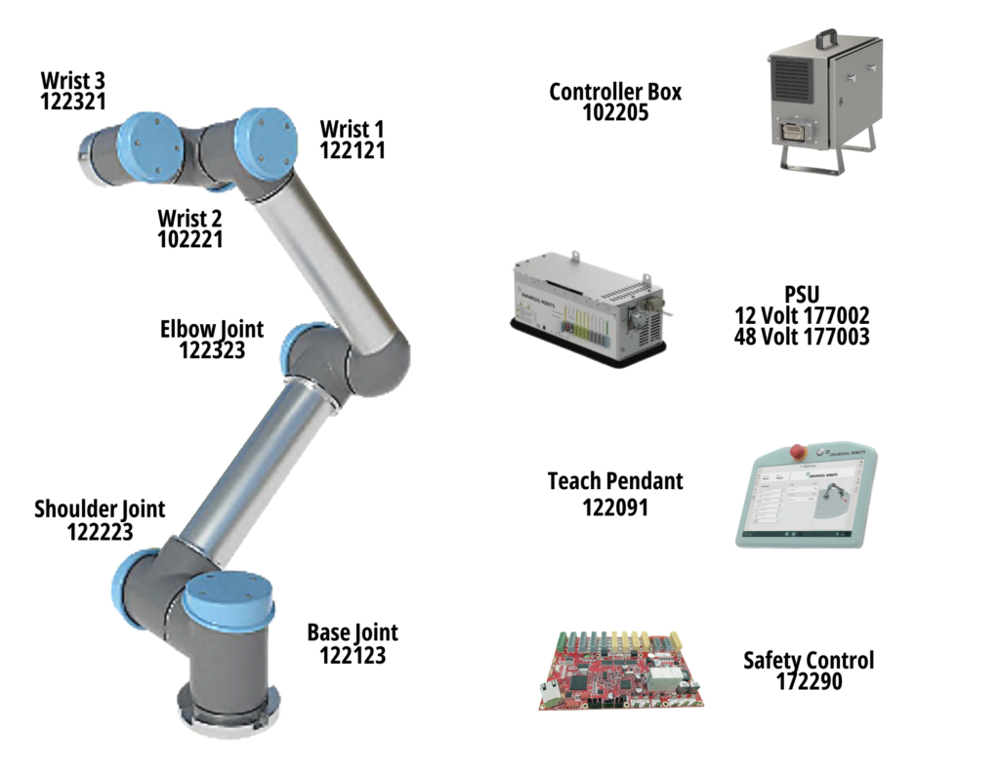
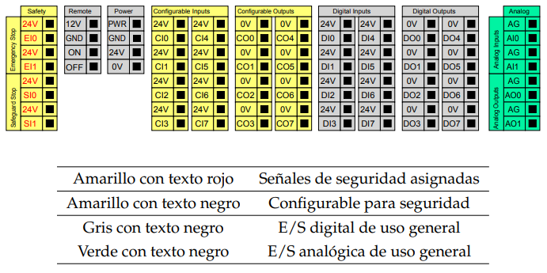
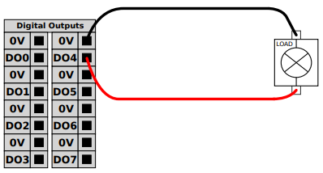
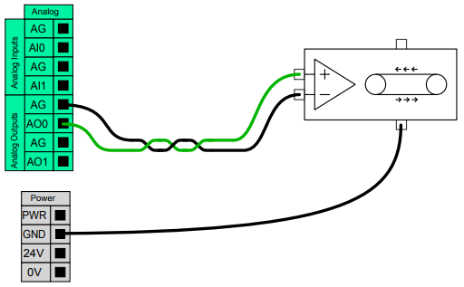
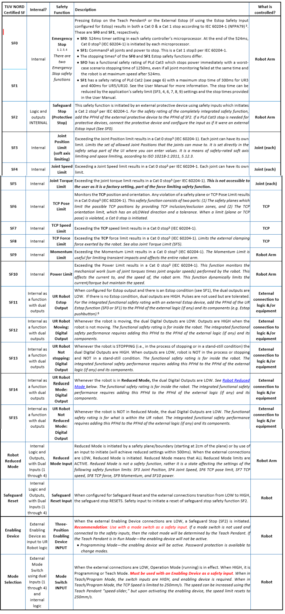
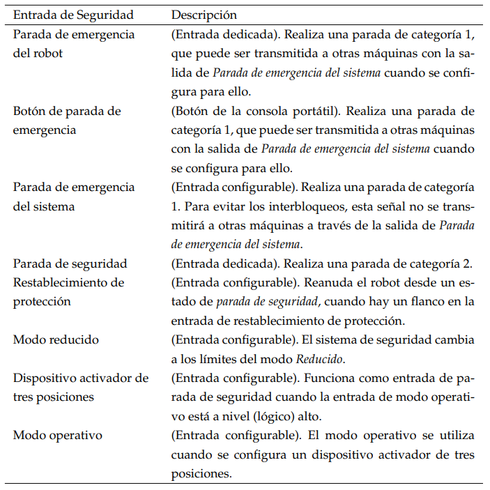
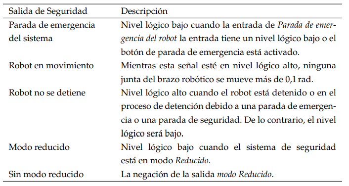
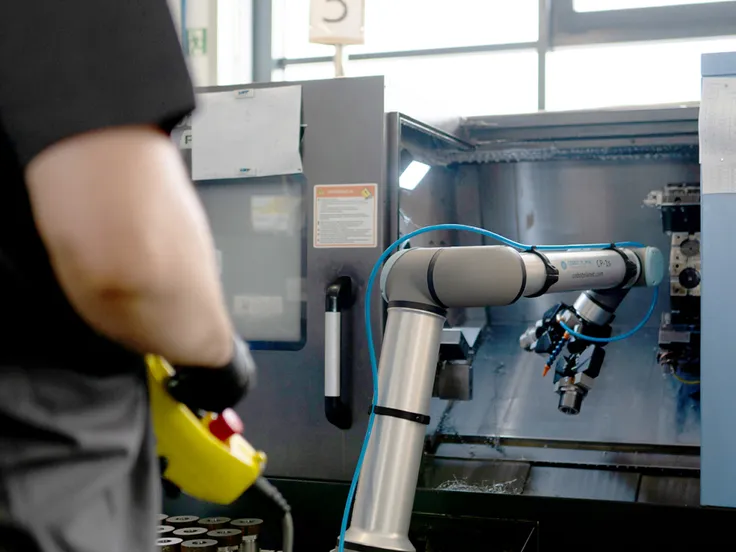
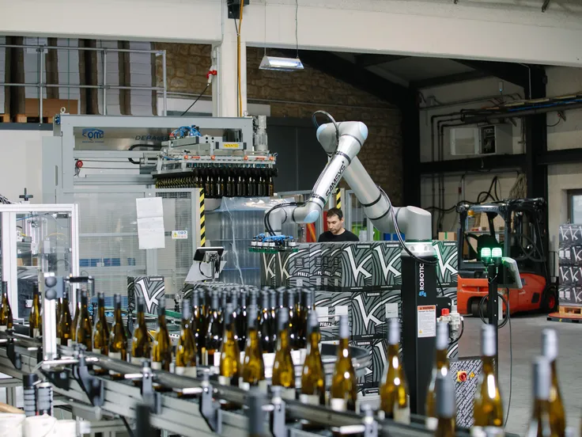

<h1>Aula 2</h1>

Esta clase consiste en presentar las principales característcas de los robots UR5 y UR10.

<h2>Robots UR</h2>

Los cobots de Universal Robots de la serie UR son de 6 GDL de morfología RRR, los cuales son colaborativos y pueden ser implementados en procesos repetitivos de bajo peso, como recoger y colocar. Los UR5 y UR10 tienen un payload de 5kg y 10kg, respectivamente.

 
<figcaption>Fuente: https://www.alibaba.com/product-detail/Small-Lift-Industrial-Robotic-Arm-UR5_1600210044673.html</figcaption>

<h3>Especificaciones técnicas</h3>

<h4>UR5</h4>

 
<figcaption>Fuente: Manual de usuario UR</figcaption>

<h4>UR10</h4>

 
<figcaption>Fuente: Manual de usuario UR</figcaption>

<h3>Espacio de trabajo</h3>

El espacio de trabajo de los robots UR5 y UR10, respectivamente son 850mm y 1300mm.

 
<figcaption>Fuente: Manual de usuario UR</figcaption>

<h3>Partes del UR5 y UR10</h3>

 
<figcaption>Fuente: https://htlelec.com/universalrobots-ur5e/</figcaption>

<h3>Caja de control</h3>

 
<figcaption>Fuente: Manual de servicio UR</figcaption>

<h4>E/S</h4>

Las E/S se encuentran en el interior de la caja de control, las cuales pueden ser conectadas a reles neumáticos, PLC y pulsadores de parada de emergencia.

 
<figcaption>Fuente: Manual de servicio UR</figcaption>

<h5>Entrada digital</h5>

 
<figcaption>Fuente: Manual de servicio UR</figcaption>

<h5>Salida digital</h5>

 
<figcaption>Fuente: Manual de servicio UR</figcaption>

<h5>E/S analógicas</h5>

Son utilizadas para establecer o medir el voltaje (0-10 V) o la corriente (4-20 mA).

<h5>Entrada analógica</h5>

 
<figcaption>Fuente: Manual de servicio UR</figcaption>

<h5>Salida analógica</h5>

 
<figcaption>Fuente: Manual de servicio UR</figcaption>

<h3>Teach pendant</h3>

 
<figcaption>Fuente: https://thinkbotsolutions.com/products/universal-robots-ur3</figcaption>

<h3>Modos de operación</h3>

1. Modo Freedrive: Se usa en la enseñanza de trayectorias, para posicionar el robot rápidamente y para ajustar las poses del robot.

- Modo para mover el robot a mano, donde los motores quedan en un estado de baja resistencia (frenos desactivados) y el operador puede guiar el brazo manualmente.
- Se activa pulsando el botón Freedrive en el teach pendant o mediante un botón externo configurado.

2. Modo manual: Se usa para crear y editar programas, enseñar puntos y trayectorias, y pruebas paso a paso.

- Modo de enseñanza y programación, en el cual, el robot no ejecuta programas automáticamente. El Movimiento eje por eje o cartesiano desde el Teach pendant y con velocidad limitada por seguridad.

3. Modo automático: Se usa en la producción normal y sistemas integrados con PLC o control externo.

- El robot ejecuta el programa previamente configurado de manera completa, sin intervención y no se permite movimiento manual directo.

<h3>Modos de seguridad</h3>

1. Modo Normal: Se usa en ciclos automáticos, con operación continua sin intervención directa del operador.

- El robot ejecuta el programa automáticamente.
- Se aplican los límites normales de seguridad (velocidad, fuerza, potencia, etc.).
- Es el modo típico en producción.

2. Modo reducido: Se usa para trabajos colaborativos humano–robot y para inspección o supervisión cercana sin detener completamente el robot.

- El robot reduce automáticamente la velocidad, aceleración, fuerza y potencia, los cuales se configuran en Safety/Reduced Mode en el PolyScope.
- Se activa mediante una entrada de seguridad (por ejemplo, una cortina de seguridad, escáner láser o puerta), al entrar una persona en una zona cercana al robot.

3. Modo de parada de seguridad: Se usa de manera controlada o no controlada para detener el robot.

- Emergency Stop (Estop): botón de emergencia.
- Protective Stop: por colisión, exceso de fuerza o límites.
- Safeguard Stop: señal externa de seguridad.

> [!IMPORTANT]  
> El robot se detiene (Cat. 0 o Cat. 1, según el caso). Requiere reconocimiento del operador para continuar.

<h3>Funciones de seguridad</h3>

En los robots colaborativos Universal Robots UR5 y UR10 de la serie CB3, las categorías 0 y 1 se refieren a tipos de parada de seguridad definidos por estándares internacionales de seguridad de maquinaria (IEC 60204-1 / normas de seguridad industrial) y describen cómo el robot detiene el movimiento cuando hay un evento de seguridad.

- La categoría 0 consiste en una parada no controlada con eliminación inmediata de potencia, por lo cual, el robot deja de recibir energía de los accionamientos de inmediato. Se usa cuando se supera un límite de seguridad crítico o hay un fallo grave en el sistema de seguridad (ej: violaciones de límites de velocidad, posición, fuerza o zonas de seguridad internas, o fallos en la lógica de seguridad ).

- La categoría 1 consiste en una parada controlada con eliminación de potencia tras detenerse, por lo cual, el robot se desacelera y se detiene de forma controlada usando potencia de accionamiento, y solo después de alcanzar el estado de parada completa se elimina la energía de los motores. Está pensada para paradas de emergencia tipo botón E-stop u otras señales de parada importantes donde la parada inmediata controlada es deseable (ej: botón de emergencia (Estop) desde el teach pendant o un dispositivo externo).

 
<figcaption>Fuente: Manual de usuario UR</figcaption>

<h3>E/S de seguridad</h3>

<h4>Entradas</h4>

 
<figcaption>Fuente: Manual de usuario UR</figcaption>

<h4>Salidas</h4>

 
<figcaption>Fuente: Manual de usuario UR</figcaption>

<h3>Ventajas</h3>

Productividad: Los cobots gestionan tareas repetitivas y ergonómicamente exigentes con precisión y consistencia, hora tras hora, turno tras turno. Diseñados para diversos entornos de producción, reducen los tiempos de ciclo y minimizan el tiempo de inactividad, generando mejoras de productividad mensurables.

 
<figcaption>Fuente: https://www.universal-robots.com</figcaption>

Flexibilidad: Consiste en adaptar el cobot a nuevos procesos es rápido y sencillo, lo que le brinda la agilidad para automatizar prácticamente cualquier tarea manual, incluso aquellas con lotes pequeños o cambios rápidos. El cobot puede reutilizar programas para tareas recurrentes.

 
<figcaption>Fuente: https://www.universal-robots.com</figcaption>

Calidad: Los cobots de Universal Robots ofrecen una repetibilidad de hasta ±0,03 mm (30 micras), lo que garantiza la precisión y fiabilidad de cada movimiento. Este nivel de precisión reduce la variabilidad, minimiza los defectos y ayuda a mantener los más altos estándares de calidad del producto durante toda la producción.

 
<figcaption>Fuente: https://www.universal-robots.com</figcaption>

<h3>Casos de estudio</h3>

Raumland GmbH es una empresa familiar que analiza, filtra, etiqueta, embotella y envía vinos para diversos productores. Con más de cinco millones de botellas y 2500 vinos diferentes procesados ​​anualmente, Raumland utiliza UR20 para paletizar cajas de vino al final de la línea de embotellado.

 
<figcaption>Fuente: https://www.universal-robots.com/products/ur-series/</figcaption>

El histórico fabricante de cereales (Bob’s Red Mill) integrales buscó durante muchos años utilizar robots colaborativos para tareas de paletizado, pero no había encontrado una solución que cumpliera los requisitos de velocidad, carga útil o alcance hasta el lanzamiento del UR20.

 
<figcaption>Fuente: https://www.universal-robots.com/products/ur-series/</figcaption>

Raise Robotics utiliza dos potentes brazos UR20 de Universal Robots como plataforma para innovadores robots de construcción in sitio. El sistema Raise se encarga de tareas repetitivas y peligrosas, como la instalación de fijaciones para paneles de vidrio en fachadas de edificios de gran altura.

 
<figcaption>Fuente: https://www.universal-robots.com/products/ur-series/</figcaption>

