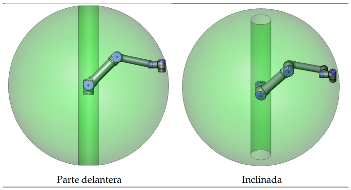
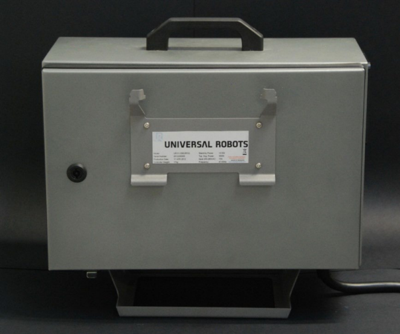
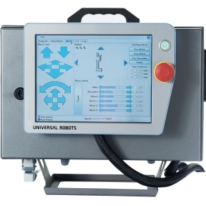

<h1>Aula 2</h1>

Esta clase consiste en presentar las principales característcas de los robots UR5 y UR10.

<h2>Robots UR</h2>

Los cobots de Universal Robots de la serie UR son de 6 GDL de morfología RRR, los cuales son colaborativos y pueden ser implementados en procesos repetitivos de bajo peso, como recoger y colocar. Los UR5 y UR10 tienen un payload de 5kg y 10kg, respectivamente.

 
<figcaption>Fuente: https://www.alibaba.com/product-detail/Small-Lift-Industrial-Robotic-Arm-UR5_1600210044673.html</figcaption>

<h3>Espacio de trabajo</h3>

El espacio de trabajo de los robots UR5 y UR10, respectivamente son 850mm y 1300mm.

 
<figcaption>Fuente: Manual de usuario UR</figcaption>

<h3>Características de seguridad</h3>

<h4>Entradas</h4>

 
<figcaption>Fuente: Manual de usuario UR</figcaption>

<h4>Salidas</h4>

 
<figcaption>Fuente: Manual de usuario UR</figcaption>

<h3>Partes del UR5 y UR10</h3>

 
<figcaption>Fuente: https://htlelec.com/universalrobots-ur5e/</figcaption>

<h3>Caja de control</h3>

 
<figcaption>Fuente: Manual de servicio UR</figcaption>

<h4>E/S</h4>

Las E/S se encuentran en el interior de la caja de control, las cuales pueden ser conectadas a reles neumáticos, PLC y pulsadores de parada de emergencia.

 
<figcaption>Fuente: Manual de servicio UR</figcaption>

<h3>Teach pendant</h3>

 
<figcaption>Fuente: https://thinkbotsolutions.com/products/universal-robots-ur3</figcaption>

<h3>Características</h3>

 
<figcaption>Fuente: https://www.universal-robots.com</figcaption>

 
<figcaption>Fuente: https://www.universal-robots.com</figcaption>

 
<figcaption>Fuente: https://www.universal-robots.com</figcaption>

<h3>Comandos</h3>

<h3></h3>
<h3></h3>
<h3></h3>
<h3></h3>
<h3></h3>
<h3></h3>
<h3></h3>
<h3></h3>