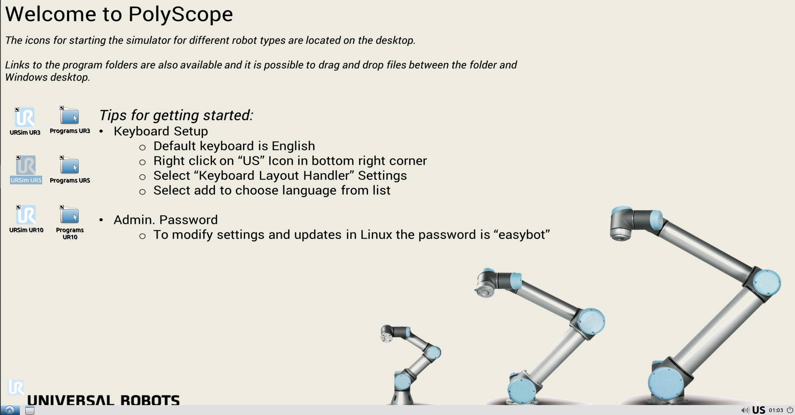
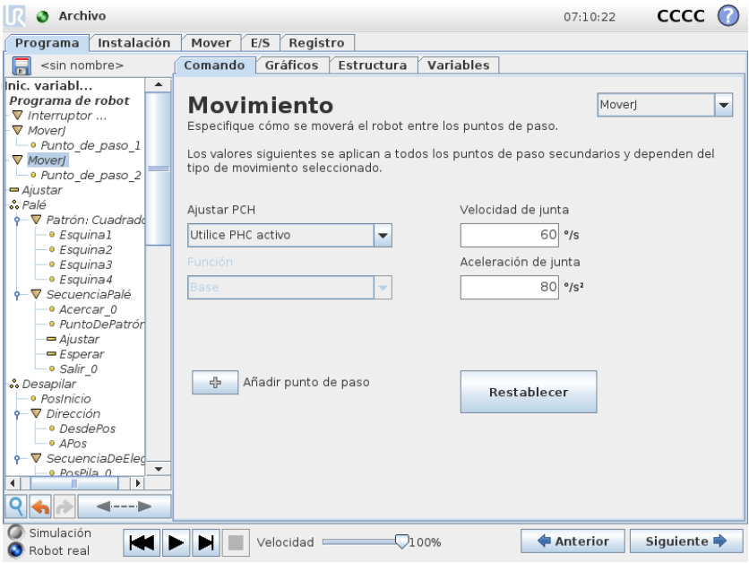
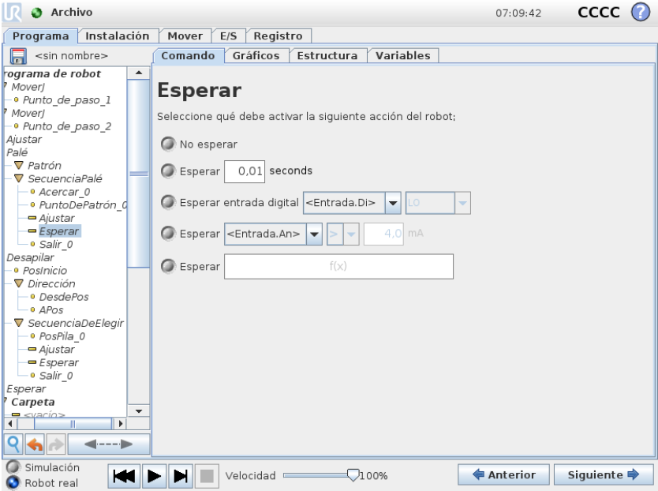
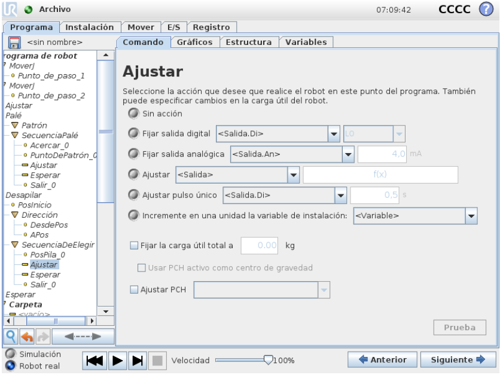
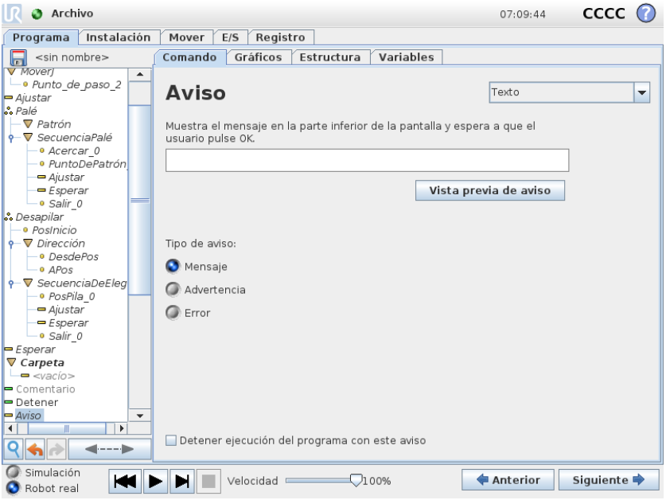
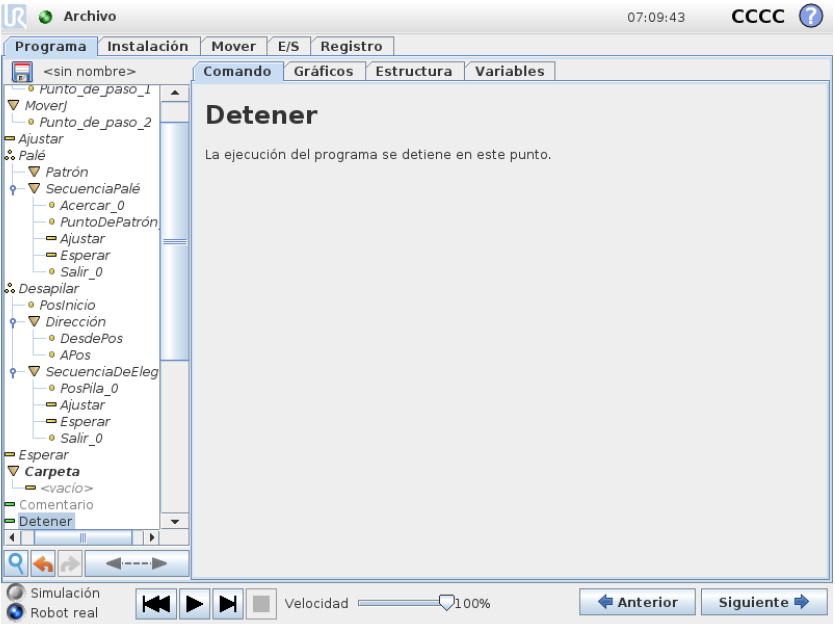
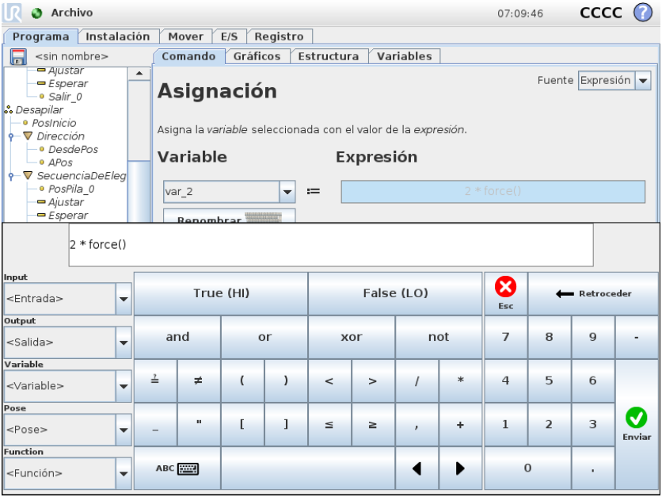
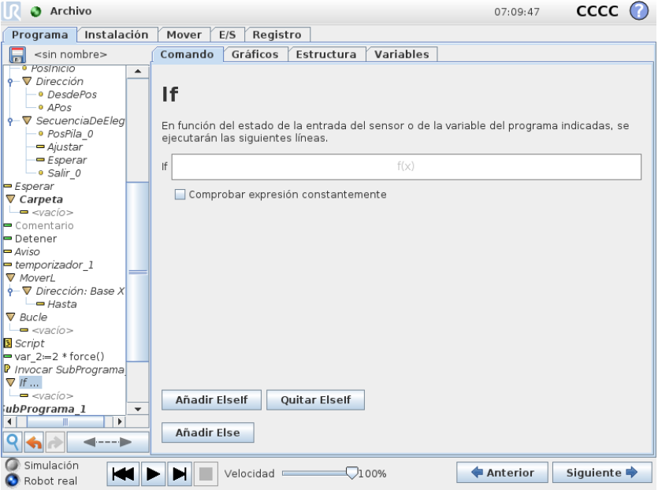
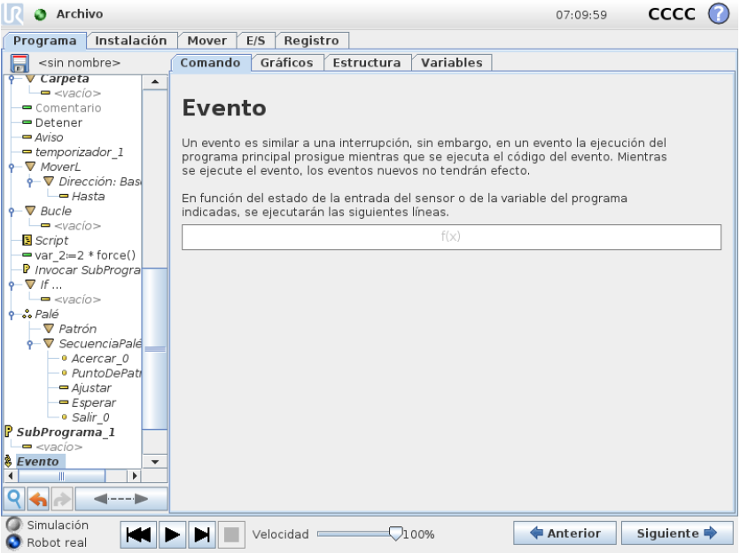

<h1>Aula 4</h1>

Esta clase consiste en aprender a utilizar el simulador para los robots UR5 y UR10 (UR sim).

<h2>UR Sim</h2>

El sistema operativo para el simulador de UR está basado en Ubuntu, por tanto, se debe instalar una máquina virtual (ej: wmware, virtualbox, etc.). El link para descargar virtualbox se encuentra <a href="https://www.virtualbox.org/wiki/Downloads">aquí</a>. El link para descargar UR Sim se encuentra <a href="https://www.universal-robots.com/download/software-cb-series/simulator-non-linux/offline-simulator-cb-series-non-linux-ursim-3158/">aquí</a>

 
<figcaption>Fuente: https://academy.universal-robots.com/es/formacion-en-linea-gratuita/</figcaption>

<h3>Comandos</h3>

Mover

Punto de paso

Esperar

Ajustar

Aviso

Detener

Comentario

Bucle

Asignación

If

Evento

Temporizador

<h3>Ejemplo</h3>

 
<figcaption>Fuente: Autor</figcaption>

