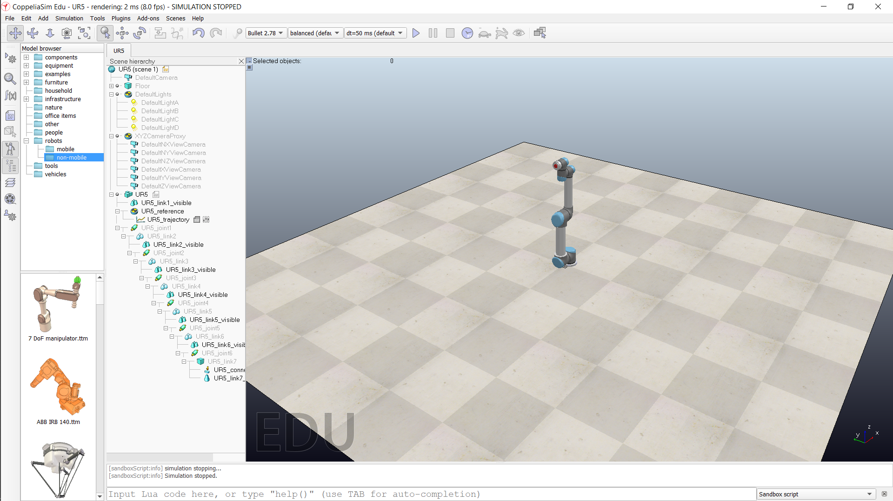

<h1>Aula 5</h1>

Esta clase consiste en simular los robots UR5 y UR10 en COPPELIA SIM.

<h2>COPPELIA SIM</h2>

COPPELIA SIM es un simulador de robótica que permite tener en cuenta las físicas de los objetos. Para descargarlo puede hacer click <a href="https://coppeliarobotics.com">aquí</a>.

<div align="center">

<br>
<figcaption>Fuente: Autor</figcaption>
</div>

El código de este ejemplo está corriendo en la versión 4.2.0 (64 bits), sin embargo, en las versiones más actuales de COPPELIA SIM no existen las mismas funciones

```lua
function sysCall_init()
    corout=coroutine.create(coroutineMain)
end

function sysCall_actuation()
    if coroutine.status(corout)~='dead' then
        local ok,errorMsg=coroutine.resume(corout)
        if errorMsg then
            error(debug.traceback(corout,errorMsg),2)
        end
    end
end

-- This is a threaded script, and is just an example!

function coroutineMain()
    J1 = sim.getObjectHandle('UR5_joint1')
    J2 = sim.getObjectHandle('UR5_joint2')
    J3 = sim.getObjectHandle('UR5_joint3')
    J4 = sim.getObjectHandle('UR5_joint4')
    J5 = sim.getObjectHandle('UR5_joint5')
    J6 = sim.getObjectHandle('UR5_joint6')
    while true do
        --Waypoint 1
        sim.setJointTargetPosition(J1,0)
        sim.setJointTargetPosition(J2,deg2rad(-135+90))
        sim.setJointTargetPosition(J3,deg2rad(90))
        sim.setJointTargetPosition(J4,deg2rad(-90+90))
        sim.setJointTargetPosition(J5,0)
        sim.setJointTargetPosition(J6,0)
        sim.wait(1)
        --Waypoint 2
        sim.setJointTargetPosition(J1,0)
        sim.setJointTargetPosition(J2,deg2rad(-113.64+90))
        sim.setJointTargetPosition(J3,deg2rad(83.32))
        sim.setJointTargetPosition(J4,deg2rad(-97.07+90))
        sim.setJointTargetPosition(J5,0)
        sim.setJointTargetPosition(J6,deg2rad(-7.62))
        sim.wait(1)
        --Waypoint 3
        sim.setJointTargetPosition(J1,0)
        sim.setJointTargetPosition(J2,deg2rad(-123.21+90))
        sim.setJointTargetPosition(J3,deg2rad(115.36))
        sim.setJointTargetPosition(J4,deg2rad(-104.33+90))
        sim.setJointTargetPosition(J5,0)
        sim.setJointTargetPosition(J6,deg2rad(-22.82))
        sim.wait(1)
        --Waypoint 4
        sim.setJointTargetPosition(J1,0)
        sim.setJointTargetPosition(J2,deg2rad(-152.22+90))
        sim.setJointTargetPosition(J3,deg2rad(122.64))
        sim.setJointTargetPosition(J4,deg2rad(-94.59+90))
        sim.setJointTargetPosition(J5,0)
        sim.setJointTargetPosition(J6,deg2rad(-10.83))
        sim.wait(1)
    end    
end

function deg2rad(angle_rad)
    -- Put some clean-up code here
    angle_deg = angle_rad*(math.pi/180)
    return angle_deg
end
```
