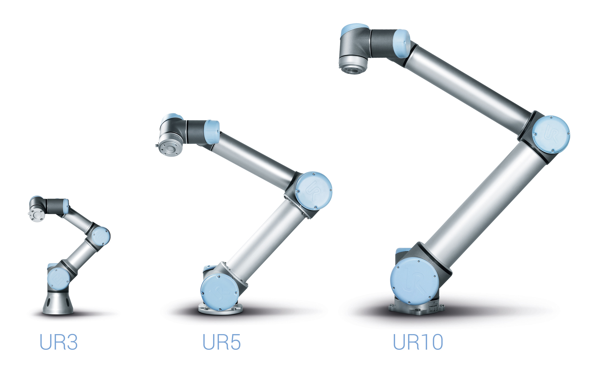
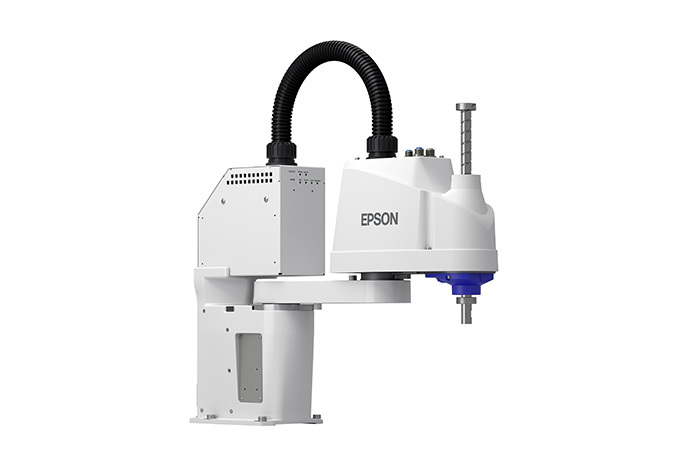

<h1 align="center">Profesor: MSc. Fabián Barrera Prieto 👨‍🏫 
Materia: Electiva interdisciplinar 2 de robótica 🦼 
Universidad: ECCI 🏫 
Año: 2026 📅</h1> 

La electiva de robótica está enfocada a la programación de los brazos manipuladores UR y EPSON.

<h1>Aula 1</h1>

En esta clase se presenta la materia, en cuanto al contenido temático, los métodos de evaluación, las observaciones, las NO EXCUSAS y los recursos para el desarrollo del curso.

<h2>Presentación de la materia 🚀</h2>

<h3>TEMAS 🤓</h3>

<h4>Primer corte</h4>

<table>
    <tr>
        <td>Fecha</td> <td>Horas</td> <td>Clase</td> <td>Semana</td> <td>Actividades</td>
    </tr>
    <tr>
        <td>02/02/2026</td> <td>2</td> <td>1</td> <td>1</td> <td>Presentación de la materia</td>
    </tr>
    <tr>
        <td>06/02/2026</td> <td>2</td> <td>2</td> <td>1</td> <td>Introducción a los robots UR</td>
    </tr>
    <tr>
        <td>09/02/2026</td> <td>2</td> <td>3</td> <td>2</td> <td>UR Sim</td>
    </tr>
    <tr>
        <td>13/02/2026</td> <td>2</td> <td>4</td> <td>2</td> <td>COPPELIA SIM</td>
    </tr>
    <tr>
        <td>16/02/2026</td> <td>2</td> <td>5</td> <td>3</td> <td>Practica robots UR5 y UR10</td>
    </tr>
    <tr>
        <td>20/02/2026</td> <td>2</td> <td>6</td> <td>3</td> <td>Desarrollo y/o entrega de Laboratorio</td>
    </tr>
    <tr>
        <td>23/02/2026</td> <td>2</td> <td>7</td> <td>4</td> <td>Desarrollo y/o entrega de Laboratorio</td>
    </tr>
    <tr>
        <td>27/02/2026</td> <td>2</td> <td>8</td> <td>4</td> <td>Desarrollo y/o entrega de Laboratorio</td>
    </tr>
    <tr>
        <td>02/03/2026</td> <td>2</td> <td>9</td> <td>5</td> <td>Desarrollo y/o entrega de Laboratorio</td>
    </tr>
    <tr>
        <td>06/03/2026</td> <td>2</td> <td>10</td> <td>5</td> <td>Desarrollo y/o entrega de Laboratorio Entrega de notas primer corte</td>
    </tr><!--semana de parciales del primer corte--><!--semana de registro de notas del primer corte-->

</table>

<h4>Segundo corte</h4>

<table>
    <tr>
        <td>Fecha</td> <td>Horas</td> <td>Clase</td> <td>Semana</td> <td>Actividades</td>
    </tr>
    <tr>
        <td>09/03/2026</td> <td>2</td> <td>11</td> <td>6</td> <td>Propuesta de proyecto</td>
    </tr>
    <tr>
        <td>13/03/2026</td> <td>2</td> <td>12</td> <td>6</td> <td>Introducción al robot SCARA (EPSON)</td>
    </tr>
    <tr>
        <td>16/03/2026</td> <td>2</td> <td>13</td> <td>7</td> <td>EPSON RC+</td>
    </tr>
    <tr>
        <td>20/03/2026</td> <td>2</td> <td>14</td> <td>7</td> <td>Practica robot SCARA</td>
    </tr>
    <tr>
        <td>23/03/2026</td> <td>2</td> <td>15</td> <td>8</td> <td>FESTIVO</td>
    </tr>
    <tr>
        <td>27/03/2026</td> <td>2</td> <td>16</td> <td>8</td> <td>Desarrollo y/o entrega de Laboratorio</td>
    </tr>
    <tr>
        <td>30/03/2026 03/04/2026</td> <td></td> <td></td> <td></td> <td>SEMANA SANTA</td>
    </tr>
    <tr>
        <td>06/04/2026</td> <td>2</td> <td>17</td> <td>9</td> <td>Desarrollo y/o entrega de Laboratorio</td>
    </tr>
    <tr>
        <td>10/04/2026</td> <td>2</td> <td>18</td> <td>9</td> <td>Desarrollo y/o entrega de Laboratorio</td>
    </tr>
    <tr>
        <td>13/04/2026</td> <td>2</td> <td>19</td> <td>10</td> <td>Desarrollo y/o entrega de Laboratorioe</td>
    </tr>
    <tr>
        <td>17/04/2026</td> <td>2</td> <td>20</td> <td>10</td> <td>Desarrollo y/o entrega de Laboratorio Entrega de notas segundo corte</td>
    </tr><!--semana de parciales del segundo corte--><!--semana de registro de notas del segundo corte-->
</table>

<h4>Tercer corte</h4>

<table>
    <tr>
        <td>Fecha</td> <td>Horas</td> <td>Clase</td> <td>Semana</td> <td>Actividades</td>
    </tr>
    <tr>
        <td>20/04/2026</td> <td>2</td> <td>21</td> <td>11</td> <td>Avance de proyecto</td>
    </tr>
    <tr>
        <td>24/04/2026</td> <td>2</td> <td>22</td> <td>11</td> <td>Desarrollo y/o entrega de laboratorio y/o proyecto</td>
    </tr>
    <tr>
        <td>27/04/2026</td> <td>2</td> <td>23</td> <td>12</td> <td>Desarrollo y/o entrega de laboratorio y/o proyecto</td>
    </tr>
    <tr>
        <td>01/05/2026</td> <td>2</td> <td>24</td> <td>13</td> <td>FESTIVO</td>
    </tr>
    <tr>
        <td>04/05/2026</td> <td>2</td> <td>25</td> <td>13</td> <td>Desarrollo y/o entrega de laboratorio y/o proyecto</td>
    </tr>
    <tr>
        <td>08/05/2026</td> <td>2</td> <td>26</td> <td>13</td> <td>Desarrollo y/o entrega de laboratorio y/o proyecto</td>
    </tr>
    <tr>
        <td>11/05/2026</td> <td>2</td> <td>27</td> <td>14</td> <td>Desarrollo y/o entrega de laboratorio y/o proyecto</td>
    </tr>
    <tr>
        <td>15/05/2026</td> <td>2</td> <td>28</td> <td>14</td> <td>Desarrollo y/o entrega de laboratorio y/o proyecto</td>
    </tr>
     <tr>
        <td>18/05/2026</td> <td>2</td> <td>29</td> <td>15</td> <td>FESTIVO</td>
    </tr>
    <tr>
        <td>22/05/2026</td> <td>2</td> <td>30</td> <td>15</td> <td>Desarrollo y/o entrega de laboratorio y/o proyecto</td>
    </tr>
    <tr>
        <td>25/05/2026</td> <td>2</td> <td>31</td> <td>16</td> <td>Desarrollo y/o entrega de laboratorio y/o proyecto</td>
    </tr>
    <tr>
        <td>29/05/2026</td> <td>2</td> <td>32</td> <td>16</td> <td>Desarrollo y/o entrega de laboratorio y/o proyecto Entrega de notas tercer corte</td>
    </tr><!--Finalización de clases-->
</table>

<h3>MÉTODOS DE EVALUACIÓN ✍️</h3>

<table>
    <tr>
        <td>Corte</td> <td>Actividad</td> <td>Porcentaje 💯</td> <td>Fecha</td> <td>Metodología</td>
    </tr>
    <tr>
        <td>Primer (20%)</td> <td>Quices y/o laboratorio</td> <td>20%</td> <td>20/02/2026 23/02/2026 27/02/2026 02/03/2026 06/03/2026</td> <td rowspan="4">Presencial</td>
    </tr>
    <tr>
        <td>Segundo (30%)</td> <td>Quices y/o laboratorio</td> <td>30%</td> <td>27/03/2026 06/04/2026 10/04/2026 13/04/2026 17/04/2026</td>
    </tr>
    <tr>
        <td rowspan="2">Tercer (50%)</td> <td>Quices y/o laboratorio</td> <td>20%</td> <td>24/04/2026 27/04/2026 04/05/2026 08/05/2026 11/05/2026 15/05/2026 22/05/2026 25/05/2026 29/05/2026</td>
    </tr>
    <tr>
        <td>Proyecto</td> <td>30%</td> <td>24/04/2026 27/04/2026 04/05/2026 08/05/2026 11/05/2026 15/05/2026 22/05/2026 25/05/2026 29/05/2026</td>
    </tr>
</table>

Nota del curso = (0.2)*NotaCorte1 + (0.3)*NotaCorte2 + (0.5)*NotaCorte3

<h3>OBSERVACIONES ⚠️</h3>

<h4>Observaciones de clase</h4>
    <ul>
        <li> Inicio de clases: Quince (15) minutos después de la hora inicial definida de la clase y el control de asistencia se realiza a cada inicio de clase ⌚</li>
        <li> Fin de clases: Quince (15) minutos antes de la hora final definida de la clase ⏱️</li>
        <li> Respeto en clase 🤝</li>
        <li> No presto mi computador para presentar laboratorios, talleres y/o proyectos 🤦‍♂️</li>
        <li> Prohibido el uso de celular en quices, parciales y clase 📵</li>
        <li> Permitidas las salidas al baño 🚻 y a recibir llamadas 📲, en los quices y parciales se debe dejar el celular en el puesto para salir al baño</li>
        <li> Si no dejan dictar la clase, pasan al tablero a dar la clase o doy la clase por vista 😤</li>
        <li> No es permitido tomar fotos, ni videos en clase 📵. El material de clase está en el siguiente repositorio git: https://github.com/FBarreraP/ElectivaIntRobotica2 </li>
        <li> Los laboratorios y el proyecto consistirán únicamente de montaje y podrán ser realizados en grupos de máximo 4 estudiantes 🧍‍♂️🧍‍♀️🧍‍♂️🧍‍♀️</li>
        <li> Los montajes realizados en protoboard no son aceptados con jumpers, por tanto, deben ser realizados con cable UTP y no son compartidos, es decir, un montaje por grupo 🤷‍♂️</li>
        <li> Los talleres se calificarán con rúbricas de 0.0 a 5.0 con intervalo de 1.0; las cuales tendrán diferentes entregables con fechas fijas de entrega y el orden de entrega de los grupos será definida por el profesor 💥</li> 
        <li> Los parciales y el examen final serán solucionados en hoja examen 📄</li> 
        <li> Uso obligatorio de bata blanca en el laboratorio 🥼</li>
        <li> Quien llegue tarde se adelanta en el tema visto hasta el momento 🏃‍♂️</li>
        <li> Subir un video grabado en la clase de entrega del funcionamiento práctico del laboratorio y proyecto en el aula virtual 🧐</li> 
    </ul>

<h4>Observaciones de reglamento estudiantil</h4>
<ul>
    <li> Revisión sobre la calificación solamente dentro de los dias (3) establecidos en el reglamento estudiantil </li>
    <li> Con el 10% de las fallas se pierde la materia</li>
    <li> Las ausencias a clases donde se saque una calificación se debe presentar la excusa familiar o laboral en la dirección del programa</li>
</ul>

<h3>NO EXCUSAS ❌</h3>

<ul>
    <li> Hace 5 minutos funcionaba (tengo un video funcionando) 😒</li>
    <li> Mi compañero tiene todo y no ha llegado 😐</li>
    <li> Mírelo ya, porque deja de funcionar 🤨</li>
    <li> Tengo más materias 🙄</li>
    <li> Trabajo y estudio 😶</li>
    <li> Se dañó en el bus 🤔</li>
    <li> No lo toque, no lo mire, ni se acerque mucho porque se daña 🤨</li>
</ul>

<h3>RECURSOS 🛠️</h3>

<ul>
    <li> Computador 💻</li>
    <li> UR sim</li>
    <li> EPSON RC+</li>
    <li> Robots UR</li>
    

        
         
        <figcaption>Fuente: https://www.logisticanews.it/robot-collaborativi-ur3-ur5-e-ur10-di-universal-robots/</figcaption>
    

    <li> Robot SCARA (EPSON)</li>
    

        
         
        <figcaption>Fuente: https://epson.co.cr/Para-el-trabajo/Robótica/SCARA/Robot-Epson-SCARA-T3-B-Todo-en-Uno/p/RT3-B401SS</figcaption>
    

    <li> Multímetro</li>
    

        
         
        <figcaption>Fuente: https://radiomecano.com.ar/Instrumentos-de-Medicion/90-0223260_TESTER-UNI-T-UT-33C-DIGITAL-CTEMPERATURA.html</figcaption>
    

</ul>